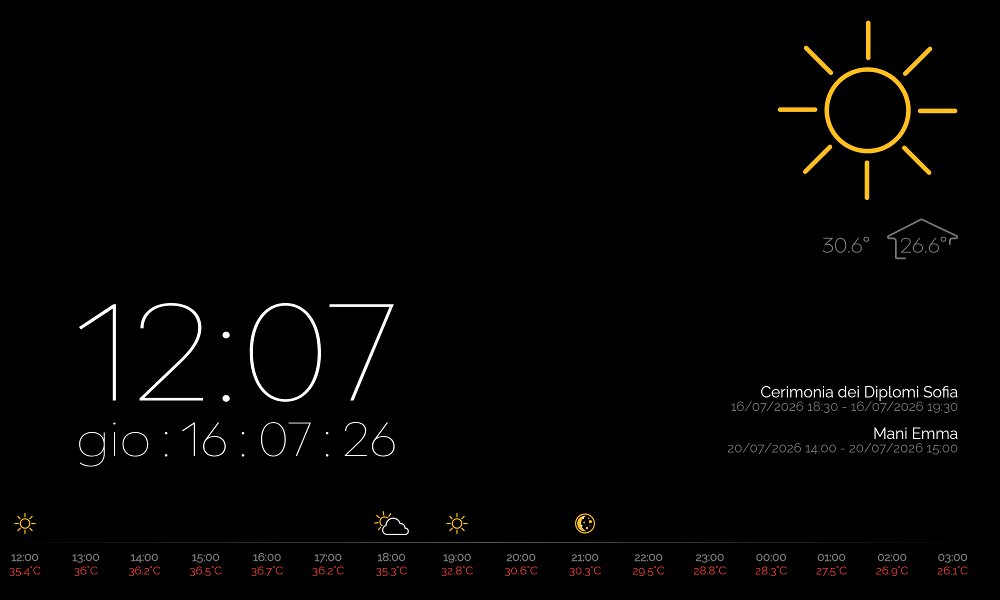
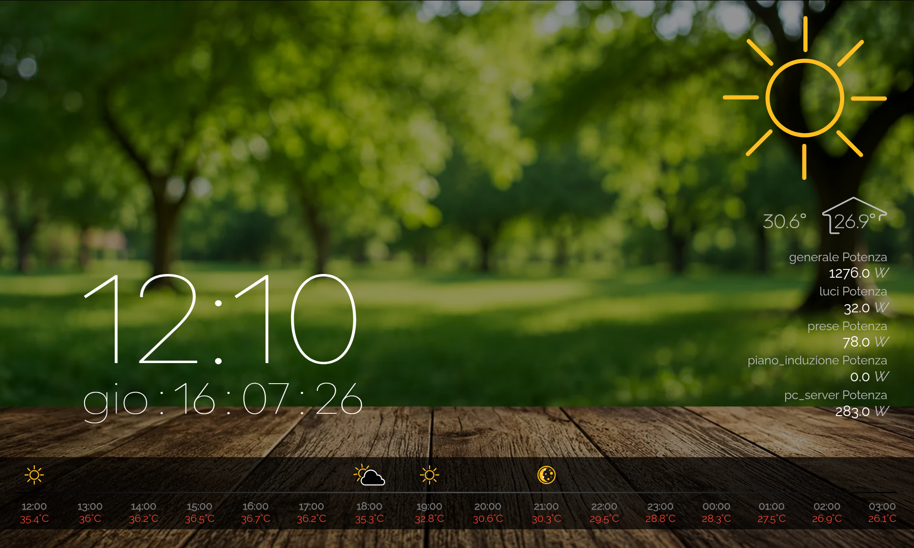
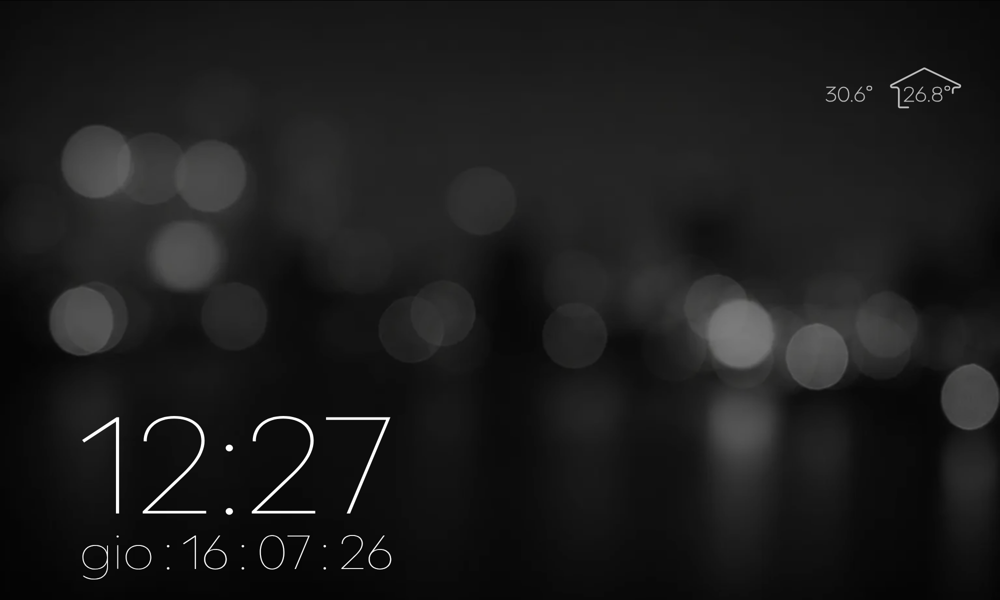
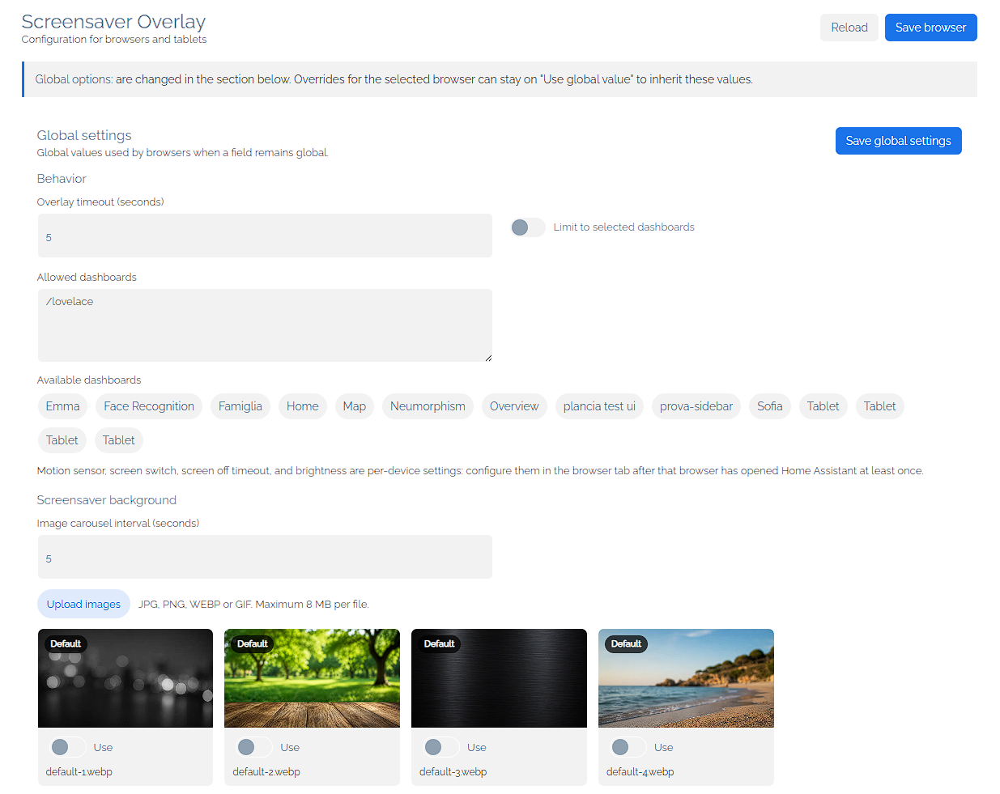
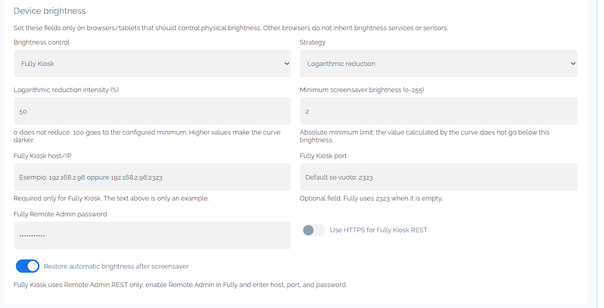
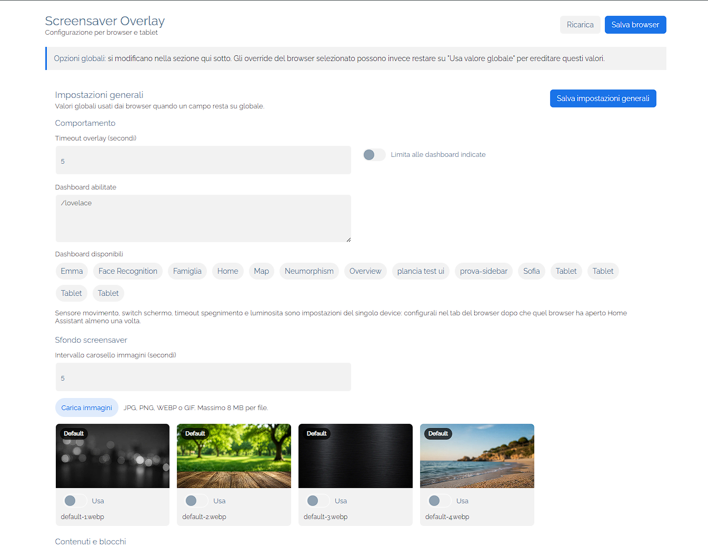
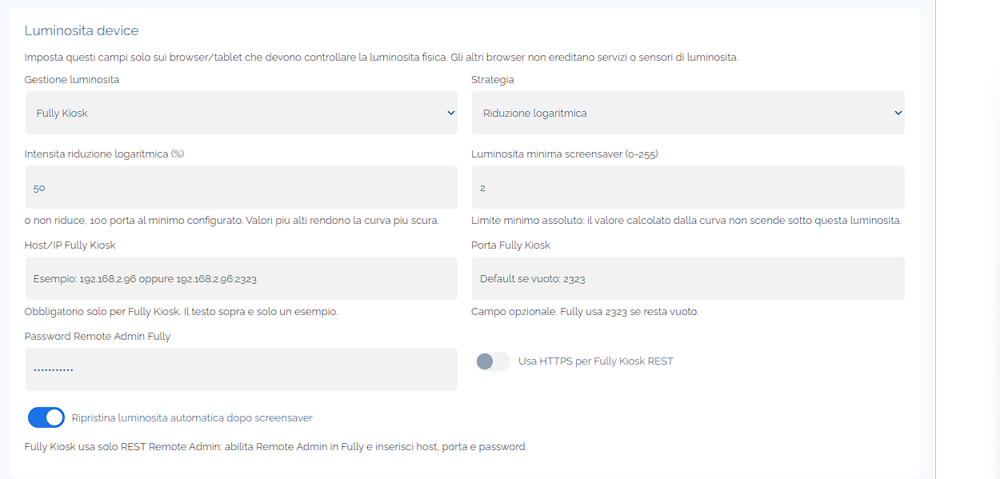

# Screensaver Overlay Custom Component








## English

Standalone Home Assistant integration that shows a global fullscreen screensaver overlay above the current dashboard.

The overlay is injected into the already loaded Home Assistant frontend: it does not load a dedicated Lovelace page, it does not navigate away from the current dashboard, and it does not reload the browser. Each browser/tablet has its own configuration, so a PC browser does not inherit brightness commands, screen switches, or Fully Kiosk credentials intended for a tablet.

### Installation

#### HACS Installation

1. Open HACS in Home Assistant.
2. Go to `Integrations`.
3. Open the menu in the top-right corner and select `Custom repositories`.
4. Add this repository URL:

```text
https://github.com/madmicio/screensaver_overlay
```

5. Select `Integration` as the category and click `Add`.
6. Search for `Screensaver Overlay` in HACS and install it.
7. Restart Home Assistant.
8. Add the integration from:

```text
Settings > Devices & services > Add integration > Screensaver Overlay
```

9. Home Assistant will register a sidebar panel named:

```text
Screensaver Overlay
```

#### Manual Installation

1. Copy this folder to:

```text
config/custom_components/screensaver_overlay
```

2. Restart Home Assistant.

3. Add the integration from:

```text
Settings > Devices & services > Add integration > Screensaver Overlay
```

4. Home Assistant will register a sidebar panel named:

```text
Screensaver Overlay
```

#### Example Screenshots

Add screenshots under:

```text
images/
```


#### Updating

1. Replace the files in `config/custom_components/screensaver_overlay`.
2. Restart Home Assistant when Python integration files changed.
3. Reload the browser/tablet page if the old panel or old overlay code is still cached.

Binary sensors enabled from the panel are created and removed without restarting Home Assistant.

### Initial Setup

Each browser/tablet receives a local browser identifier stored in `localStorage`. For this reason, a browser appears in the panel only after Home Assistant has been opened from that device at least once.

Recommended flow:

1. Install and configure the integration.
2. Open Home Assistant from the tablet/browser that should use the screensaver.
3. Open the `Screensaver Overlay` sidebar panel.
4. Select the newly registered browser tab.
5. Enable `Screensaver enabled on this browser`.
6. Configure behavior, brightness, screen control, and content for that browser.
7. Save the browser configuration.

Repeat this flow for each tablet, kiosk browser, PC, wall panel, or phone.

### Global And Browser Settings

#### Global Settings



Global settings are shared defaults that are safe for every browser:

- weather entity
- weather description sensor
- internal/external temperature sensors
- rain sensor
- calendars
- value entities
- status icon entities
- visible blocks
- weather icon size
- info text size
- maximum number of info items
- overlay idle timeout
- dashboard path limit
- backgrounds and image carousel

Browser fields left empty or set to `Global` inherit these values.

#### Browser/Device Settings

Device settings are configured only inside each browser tab:

- enable/disable screensaver for that browser
- create binary sensor for automations
- motion sensor
- screen switch
- screen off timeout
- brightness mode
- brightness strategy
- Companion App notify service
- Companion App brightness sensor
- brightness reduction percentage/intensity
- minimum brightness for logarithmic curve
- fixed dashboard/screensaver brightness values
- Fully Kiosk host, port, password, and HTTPS
- automatic brightness restore

If a browser has no device settings:

- the overlay can still appear using global content/layout settings
- the integration does not turn switches on/off
- the integration does not change brightness
- the integration does not call tablet notify services

#### Enabled Browser Rule

The panel includes this global rule:

```text
Run screensaver only on enabled browsers
```

When disabled, new browsers can use the global screensaver behavior. When enabled, the screensaver runs only on browsers explicitly enabled in their browser tab.

### Features

#### Fullscreen Overlay

The screensaver appears after the configured idle timeout. When the user interacts with the browser, the overlay is hidden and the underlying dashboard remains loaded.

The overlay can show:

- clock
- weather
- temperatures
- calendar
- value entities
- status icons
- black background or configured images
- image carousel

#### Features Enabled By Configured Entities

The overlay enables different features depending on which entities and browser options are configured.

| Configuration | Enabled feature |
| --- | --- |
| `weather_entity` | Main weather block, current weather icon, weather temperature fallback, units, and hourly forecast source |
| `weather_description_entity` | Textual weather description under the weather icon, when the entity state is valid |
| `external_temperature` | External temperature override instead of `weather_entity.attributes.temperature` |
| `internal_temperature` | Internal temperature display together with the external temperature |
| `rain_sensor` | Animated rain icon when the sensor state is exactly `raining` |
| `calendars` | Calendar event list for the next days and `cg_alert` detection |
| `value_entities` | Sensor/value list with friendly name, state, and unit of measurement |
| `status_icon_entities` | Status icons shown only when their entities are active |
| `motion_sensor` | Screen-off guard and wake behavior while the screensaver is active |
| `screen_switch` | Screen on/off control through a Home Assistant switch when Fully Kiosk is not used |
| `expose_binary_sensor` | Per-browser binary sensor for automations |

`weather_entity` is the main weather source. It powers the current weather icon and, when `external_temperature` is not configured, also provides the external temperature from the weather entity attributes. If hourly forecast is enabled, the integration subscribes to the forecast for this entity.

`weather_description_entity` is optional and only controls the text description shown below the weather icon. States such as `unknown` and `unavailable` are ignored.

`external_temperature` and `internal_temperature` control the temperature block. With only an external temperature, the overlay shows the outside value. When an internal temperature is configured too, the overlay shows the internal/external temperature layout.

`rain_sensor` is optional. When its state is exactly `raining`, the overlay uses the animated rain icon even if the main weather entity has a different state.

`calendars` enables the calendar information block. Events are fetched, sorted, deduplicated, and limited by `info_items_limit`. If `value_entities` are also configured, the information block alternates between calendar events and sensor values.

Calendar events with summary exactly equal to `cg_alert` are treated as a discreet alert. While the event is active, the overlay shows a small red dot and the `cg_alert` event is not listed with normal calendar events.

`value_entities` enables the value information block. Each configured entity can show its friendly name, current state, and unit of measurement. Numeric states are formatted with one decimal digit.

`status_icon_entities` enables status icons. An icon is shown only when the entity state is active, for example `on`, `open`, `playing`, `home`, or a numeric state greater than zero.

Each status icon can optionally use a custom Material Design Icon selected from the sidebar panel icon picker:

```text
mdi:lightbulb
```

The custom icon only changes the icon shown by the screensaver. It does not modify the Home Assistant entity. Custom status icons are configured in the sidebar panel, not in the standard Home Assistant options flow.

`motion_sensor`, `screen_switch`, and `screen_off_timeout` work together for screen control. The motion sensor does not start the screensaver; it decides whether the screen can be turned off after the overlay is already active and wakes the screen again when motion returns. The screen can be controlled through a Home Assistant switch or through Fully Kiosk Remote Admin when Fully is configured.

`expose_binary_sensor` creates a dedicated binary sensor for the selected browser. The sensor turns `on` only while that specific browser is showing the screensaver and turns `off` when the overlay is hidden.

#### Dashboard Limits

You can restrict the screensaver to a list of dashboard paths. If the current dashboard is not included, the overlay will not start on that browser.

Example paths:

```text
/lovelace
/dashboard-tablet
/dashboard-home/living-room
```

#### Backgrounds

The panel supports:

- inherited background
- black background
- uploaded images
- bundled default images
- carousel with configurable interval

Uploaded backgrounds are stored in Home Assistant and can be selected globally or per browser.

### Brightness



Brightness control is always configured per browser/device.

#### Available Modes

| Mode | Required fields | Behavior |
| --- | --- | --- |
| Disabled | none | Does not change brightness |
| Companion App | Companion notify service; brightness sensor for dynamic strategies | Sends Android commands through Home Assistant Companion App |
| Fully Kiosk | Remote Admin host, port, and password | Reads and writes brightness through Fully Kiosk REST |

#### Available Strategies

| Strategy | Behavior |
| --- | --- |
| Percentage reduction | Reads current brightness and reduces it by the configured percentage |
| Logarithmic reduction | Reads current brightness and applies a stronger curve at low values |
| Fixed values | Uses one fixed value for the dashboard and one fixed value for the screensaver |

#### Percentage Reduction

The formula is linear:

```text
target = current_brightness * (100 - percentage) / 100
```

Examples:

| Current | Reduction | Target |
| --- | --- | --- |
| 200 | 50% | 100 |
| 20 | 50% | 10 |

#### Logarithmic Reduction

The logarithmic strategy uses two fields:

- `Logarithmic reduction intensity (%)`: 0 does not reduce, 100 goes down to the configured minimum.
- `Minimum screensaver brightness (0-255)`: absolute lower limit; the calculated target never goes below this value.

This strategy is useful when percentage reduction is too weak at night. With low starting brightness, the curve reduces more aggressively than the linear percentage strategy.

Examples with intensity 50% and minimum 1:

| Current | Approximate target |
| --- | --- |
| 200 | 95.6 |
| 20 | 5.5 |
| 2 | 1 |

Example with intensity 100% and minimum 3:

| Current | Target |
| --- | --- |
| 20 | 3 |

#### Fixed Values

This strategy does not read current brightness. It uses:

- `Screensaver brightness value`
- `Dashboard brightness value`

Use it when you want fixed levels independent from ambient light or automatic brightness.

#### Android Companion App

Use the full notify service name:

```yaml
notify.mobile_app_tablet_name
```

Command used to set brightness:

```yaml
service: notify.mobile_app_tablet_name
data:
  message: command_screen_brightness_level
  data:
    command: 40
```

Command used to restore automatic brightness:

```yaml
service: notify.mobile_app_tablet_name
data:
  message: command_auto_screen_brightness
  data:
    command: turn_on
```

Notes:

- Companion App brightness control is Android-only
- iOS/iPadOS can show the overlay, but cannot change brightness with this integration
- Android may ask for permission to modify system settings
- percentage/logarithmic strategies require the Companion brightness sensor to update frequently, about every 15 seconds
- if commands are delayed, disable battery optimization for Home Assistant Companion App

#### Fully Kiosk

Fully Kiosk uses only Remote Admin REST. It does not use Home Assistant `number` entities for brightness.

Configure in the browser tab:

- tablet host or IP
- Remote Admin port, default `2323`
- Remote Admin password
- HTTPS, if used by Fully

The integration handles the Fully Kiosk commands internally. Users only need to fill in the Remote Admin fields in the browser settings panel.

When Fully Kiosk is configured, screen on/off also uses Fully Kiosk Remote Admin internally.

In this mode, a Home Assistant screen switch is not required.

### Screen Off Behavior

Screen off is configured per browser/device.

When configured:

- the overlay appears after the idle timeout
- brightness is applied using the selected strategy
- after the screen off timeout, the display is turned off only if the motion sensor is `off`
- when the motion sensor turns `on`, the display is turned back on
- if the screen wakes while the overlay is still active, screensaver brightness is reapplied
- normal brightness is restored only when the overlay is closed by user interaction

Screen control can use:

- a Home Assistant switch, when Fully is not used
- Fully Kiosk REST `screenOn` / `screenOff`, when Fully is configured

### Binary Sensor For Automations

Each browser can create its own dedicated binary sensor. The option is in the browser tab:

```text
Create binary sensor for automations
```

Default: disabled.

When enabled and saved:

- a `binary_sensor` entity is created
- Home Assistant does not need to be restarted
- the sensor turns `on` only when that specific browser is showing the screensaver
- the sensor turns `off` when that specific browser hides the screensaver
- if the option is disabled and saved, the entity is removed

Exposed attributes:

| Attribute | Meaning |
| --- | --- |
| `client_id` | local browser identifier |
| `client_name` | browser name configured in the panel |

Automation example:

```yaml
alias: When tablet screensaver turns on
trigger:
  - platform: state
    entity_id: binary_sensor.tablet_screensaver_active
    to: "on"
action:
  - service: light.turn_off
    target:
      entity_id: light.tablet_backlight_helper
```

The final entity id depends on the name assigned by Home Assistant. After enabling the option, search for the binary sensor in `Settings > Devices & services > Entities`.

### Operational Notes

- Restart Home Assistant after Python integration changes or version updates.
- Reload the browser/tablet page if old frontend code is still visible.
- If a browser does not appear in the panel, open Home Assistant from that browser and reload the panel.
- If Companion brightness cannot be read, check that the device brightness sensor is enabled and updating.
- If Fully does not respond, check Remote Admin, IP, port, password, and HTTPS.

---

## Italiano

Integrazione Home Assistant standalone per mostrare uno screensaver fullscreen globale sopra la dashboard corrente.

L'overlay viene iniettato nel frontend Home Assistant gia aperto: non carica una pagina Lovelace dedicata, non cambia dashboard e non ricarica il browser. Ogni browser/tablet ha una configurazione propria, cosi un PC non eredita comandi di luminosita, switch schermo o impostazioni Fully Kiosk pensate per un tablet.

### Installazione

#### Installazione con HACS

1. Apri HACS in Home Assistant.
2. Vai in `Integrazioni`.
3. Apri il menu in alto a destra e seleziona `Repository personalizzati`.
4. Aggiungi questo URL del repository:

```text
https://github.com/madmicio/screensaver_overlay
```

5. Seleziona `Integrazione` come categoria e clicca `Aggiungi`.
6. Cerca `Screensaver Overlay` in HACS e installalo.
7. Riavvia Home Assistant.
8. Aggiungi l'integrazione da:

```text
Impostazioni > Dispositivi e servizi > Aggiungi integrazione > Screensaver Overlay
```

9. Dopo l'aggiunta, Home Assistant registra un pannello laterale chiamato:

```text
Screensaver Overlay
```

#### Installazione manuale

1. Copia questa cartella in:

```text
config/custom_components/screensaver_overlay
```

2. Riavvia Home Assistant.

3. Aggiungi l'integrazione da:

```text
Impostazioni > Dispositivi e servizi > Aggiungi integrazione > Screensaver Overlay
```

4. Dopo l'aggiunta, Home Assistant registra un pannello laterale chiamato:

```text
Screensaver Overlay
```

#### Immagini Di Esempio

Inserisci gli screenshot in:

```text
images/
```


#### Aggiornamento

1. Sostituisci i file in `config/custom_components/screensaver_overlay`.
2. Riavvia Home Assistant quando cambiano file Python dell'integrazione.
3. Ricarica la pagina del browser/tablet se vedi ancora il vecchio pannello o il vecchio overlay.

Le entita binary sensor abilitate dal pannello vengono create e rimosse senza riavviare Home Assistant.

### Setup Iniziale

Ogni browser/tablet riceve un identificativo locale salvato in `localStorage`. Per questo motivo un browser compare nel pannello solo dopo aver aperto Home Assistant almeno una volta da quel dispositivo.

Flusso consigliato:

1. Installa e configura l'integrazione.
2. Apri Home Assistant dal tablet/browser che deve usare lo screensaver.
3. Apri il pannello laterale `Screensaver Overlay`.
4. Seleziona la scheda del browser appena registrato.
5. Abilita `Screensaver abilitato su questo browser`.
6. Configura comportamento, luminosita, schermo e contenuti per quel browser.
7. Salva la configurazione browser.

Ripeti lo stesso flusso per ogni tablet, kiosk browser, PC, wall panel o telefono.

### Regole Globali E Browser



#### Impostazioni globali

Le impostazioni globali sono valori condivisi e sicuri per tutti i browser:

- entita meteo
- sensore descrizione meteo
- sensori temperatura interna/esterna
- sensore pioggia
- calendari
- entita valore
- entita icone stato
- blocchi visibili
- dimensione icona meteo
- dimensione testo informazioni
- numero massimo elementi informativi
- timeout overlay
- limitazione a dashboard specifiche
- sfondi e carosello immagini

I campi browser lasciati vuoti o su `Globale` ereditano questi valori.

#### Impostazioni browser/device

Le impostazioni device sono configurate solo nella scheda del singolo browser:

- abilita/disabilita screensaver per quel browser
- crea binary sensor per automazioni
- sensore movimento
- switch schermo
- timeout spegnimento schermo
- modalita luminosita
- strategia luminosita
- servizio notify Companion App
- sensore luminosita Companion App
- percentuale/intensita riduzione luminosita
- luminosita minima per curva logaritmica
- valori fissi dashboard/screensaver
- host, porta, password e HTTPS Fully Kiosk
- ripristino luminosita automatica

Se un browser non ha impostazioni device:

- l'overlay puo comunque apparire usando i valori globali
- l'integrazione non accende/spegne switch
- l'integrazione non cambia luminosita
- l'integrazione non chiama servizi notify del tablet

#### Regola browser abilitati

Nel pannello esiste la regola globale:

```text
Esegui screensaver solo sui browser abilitati
```

Quando e disattivata, i nuovi browser possono usare il comportamento globale. Quando e attivata, lo screensaver viene eseguito solo sui browser marcati come abilitati nella rispettiva scheda.

### Funzioni

#### Overlay fullscreen

Lo screensaver appare dopo il timeout di inattivita configurato. Quando l'utente interagisce con il browser, l'overlay viene nascosto e la dashboard sottostante resta quella gia caricata.

L'overlay puo mostrare:

- orologio
- meteo
- temperature
- calendario
- entita valore
- icone di stato
- sfondo nero o immagini configurate
- carosello immagini

#### Funzioni Abilitate Dalle Entita Configurate

L'overlay abilita funzioni diverse in base alle entita e alle opzioni browser configurate.

| Configurazione | Funzione abilitata |
| --- | --- |
| `weather_entity` | Blocco meteo principale, icona meteo corrente, fallback temperatura meteo, unita di misura e sorgente previsioni orarie |
| `weather_description_entity` | Descrizione testuale del meteo sotto l'icona, quando lo stato dell'entita e valido |
| `external_temperature` | Temperatura esterna dedicata al posto di `weather_entity.attributes.temperature` |
| `internal_temperature` | Visualizzazione temperatura interna insieme alla temperatura esterna |
| `rain_sensor` | Icona pioggia animata quando lo stato del sensore e esattamente `raining` |
| `calendars` | Lista eventi calendario dei prossimi giorni e rilevamento `cg_alert` |
| `value_entities` | Lista sensori/valori con nome leggibile, stato e unita di misura |
| `status_icon_entities` | Icone di stato mostrate solo quando le entita sono attive |
| `motion_sensor` | Controllo spegnimento schermo e riaccensione mentre lo screensaver e attivo |
| `screen_switch` | Accensione/spegnimento schermo tramite switch Home Assistant quando non si usa Fully Kiosk |
| `expose_binary_sensor` | Binary sensor per-browser per automazioni |

`weather_entity` e la sorgente meteo principale. Alimenta l'icona meteo corrente e, quando `external_temperature` non e configurata, fornisce anche la temperatura esterna dagli attributi dell'entita meteo. Se le previsioni orarie sono abilitate, l'integrazione usa questa entita come sorgente forecast.

`weather_description_entity` e opzionale e controlla solo la descrizione testuale mostrata sotto l'icona meteo. Stati come `unknown` e `unavailable` vengono ignorati.

`external_temperature` e `internal_temperature` controllano il blocco temperature. Con solo la temperatura esterna, l'overlay mostra il valore esterno. Quando e configurata anche la temperatura interna, l'overlay mostra il layout temperatura interna/esterna.

`rain_sensor` e opzionale. Quando il suo stato e esattamente `raining`, l'overlay usa l'icona pioggia animata anche se l'entita meteo principale ha uno stato diverso.

`calendars` abilita il blocco informazioni calendario. Gli eventi vengono letti, ordinati, deduplicati e limitati da `info_items_limit`. Se sono configurate anche `value_entities`, il blocco informazioni alterna eventi calendario e valori sensore.

Gli eventi calendario con titolo esattamente uguale a `cg_alert` vengono trattati come alert discreto. Mentre l'evento e attivo, l'overlay mostra un piccolo punto rosso e l'evento `cg_alert` non viene mostrato nella lista eventi normale.

`value_entities` abilita il blocco informazioni valori. Ogni entita configurata puo mostrare nome leggibile, stato corrente e unita di misura. Gli stati numerici vengono formattati con una cifra decimale.

`status_icon_entities` abilita le icone di stato. Un'icona viene mostrata solo quando lo stato dell'entita e attivo, per esempio `on`, `open`, `playing`, `home` o un valore numerico maggiore di zero.

Ogni icona di stato puo usare un valore Material Design Icon custom selezionato dal picker icone del pannello laterale:

```text
mdi:lightbulb
```

L'icona custom cambia solo l'icona mostrata dallo screensaver. Non modifica l'entita Home Assistant. Le icone di stato custom si configurano dal pannello laterale, non dal flusso opzioni standard di Home Assistant.

`motion_sensor`, `screen_switch` e `screen_off_timeout` lavorano insieme per il controllo schermo. Il sensore movimento non avvia lo screensaver; decide se lo schermo puo essere spento dopo che l'overlay e gia attivo e riaccende lo schermo quando torna movimento. Lo schermo puo essere controllato tramite switch Home Assistant o tramite Fully Kiosk Remote Admin quando Fully e configurato.

`expose_binary_sensor` crea un binary sensor dedicato per il browser selezionato. Il sensore va `on` solo mentre quello specifico browser mostra lo screensaver e torna `off` quando l'overlay viene nascosto.

#### Limitazione dashboard

Puoi limitare lo screensaver a una lista di percorsi dashboard. Se la dashboard corrente non e inclusa, l'overlay non parte su quel browser.

Esempi di percorsi:

```text
/lovelace
/dashboard-tablet
/dashboard-casa/soggiorno
```

#### Sfondi

Il pannello permette di usare:

- sfondo ereditato
- sfondo nero
- immagini caricate
- immagini predefinite incluse
- carosello con intervallo configurabile

Gli sfondi caricati vengono salvati in Home Assistant e possono essere selezionati per configurazione globale o per singolo browser.

### Luminosita



La gestione luminosita e sempre per singolo browser/device.

#### Modalita disponibili

| Modalita | Campi richiesti | Comportamento |
| --- | --- | --- |
| Disabilitato | nessuno | Non cambia la luminosita |
| App Companion | servizio notify Companion; sensore luminosita per strategie dinamiche | Invia comandi Android tramite Home Assistant Companion App |
| Fully Kiosk | host, porta e password Remote Admin | Legge e scrive luminosita tramite REST Fully Kiosk |

#### Strategie disponibili

| Strategia | Comportamento |
| --- | --- |
| Riduzione percentuale | Legge la luminosita corrente e la riduce della percentuale configurata |
| Riduzione logaritmica | Legge la luminosita corrente e applica una curva piu aggressiva sui valori bassi |
| Valori fissi | Usa un valore fisso per dashboard e uno per screensaver |

#### Riduzione percentuale

La formula e lineare:

```text
target = luminosita_corrente * (100 - percentuale) / 100
```

Esempi:

| Corrente | Riduzione | Target |
| --- | --- | --- |
| 200 | 50% | 100 |
| 20 | 50% | 10 |

#### Riduzione logaritmica

La strategia logaritmica usa due campi:

- `Intensita riduzione logaritmica (%)`: 0 non riduce, 100 porta al minimo configurato.
- `Luminosita minima screensaver (0-255)`: limite minimo assoluto sotto cui il target non scende.

Questa strategia e utile quando la riduzione percentuale e troppo debole di notte. Con valori bassi di partenza, la curva riduce di piu rispetto alla percentuale lineare.

Esempi con intensita 50% e minimo 1:

| Corrente | Target indicativo |
| --- | --- |
| 200 | 95.6 |
| 20 | 5.5 |
| 2 | 1 |

Esempio con intensita 100% e minimo 3:

| Corrente | Target |
| --- | --- |
| 20 | 3 |

#### Valori fissi

Questa strategia non legge la luminosita corrente. Usa:

- `Valore luminosita screensaver`
- `Valore luminosita dashboard`

E utile quando vuoi livelli sempre uguali, indipendenti dalla luminosita automatica o dalla luce ambiente.

#### Companion App Android

Per usare App Companion, inserisci il servizio notify completo:

```yaml
notify.mobile_app_nome_tablet
```

Comando usato per impostare la luminosita:

```yaml
service: notify.mobile_app_nome_tablet
data:
  message: command_screen_brightness_level
  data:
    command: 40
```

Comando usato per ripristinare luminosita automatica:

```yaml
service: notify.mobile_app_nome_tablet
data:
  message: command_auto_screen_brightness
  data:
    command: turn_on
```

Note:

- il controllo luminosita Companion App e supportato solo su Android
- iOS/iPadOS possono mostrare l'overlay, ma non possono cambiare luminosita con questa integrazione
- Android puo chiedere il permesso per modificare impostazioni di sistema
- per strategie percentuale/logaritmica serve il sensore luminosita Companion aggiornato spesso, circa ogni 15 secondi
- se i comandi arrivano in ritardo, disattiva l'ottimizzazione batteria per Home Assistant Companion App

#### Fully Kiosk

Fully Kiosk usa solo REST Remote Admin. Non usa entita `number` di Home Assistant per la luminosita.

Configura nella scheda browser:

- host o IP del tablet
- porta Remote Admin, default `2323`
- password Remote Admin
- HTTPS se usato da Fully

L'integrazione gestisce internamente i comandi Fully Kiosk. L'utente deve solo compilare i campi Remote Admin nel pannello impostazioni del browser.

Quando Fully Kiosk e configurato, anche accensione/spegnimento schermo usa internamente Fully Kiosk Remote Admin.

In questa modalita non serve indicare uno switch schermo Home Assistant.

### Spegnimento Schermo

Lo spegnimento schermo e configurato per browser/device.

Quando configurato:

- l'overlay appare dopo il timeout inattivita
- la luminosita viene applicata secondo la strategia scelta
- dopo il timeout spegnimento schermo, il display viene spento solo se il sensore movimento e `off`
- quando il sensore movimento torna `on`, il display viene riacceso
- se lo schermo si riaccende mentre l'overlay e ancora attivo, la luminosita screensaver viene riapplicata
- la luminosita normale viene ripristinata solo quando l'overlay viene chiuso da interazione utente

Puoi controllare lo schermo con:

- switch Home Assistant, se non usi Fully
- REST Fully Kiosk `screenOn` / `screenOff`, se Fully e configurato

### Binary Sensor Per Automazioni

Ogni browser puo creare un binary sensor dedicato. L'opzione e nella scheda del browser:

```text
Crea binary sensor per automazioni
```

Default: disattivato.

Quando lo abiliti e salvi:

- viene creata un'entita `binary_sensor`
- non serve riavviare Home Assistant
- il sensore va `on` solo quando quello specifico browser mostra lo screensaver
- il sensore torna `off` quando quello specifico browser nasconde lo screensaver
- se disabiliti l'opzione e salvi, l'entita viene rimossa

Attributi esposti:

| Attributo | Significato |
| --- | --- |
| `client_id` | identificativo locale del browser |
| `client_name` | nome configurato nel pannello |

Esempio automazione:

```yaml
alias: Quando lo screensaver tablet si attiva
trigger:
  - platform: state
    entity_id: binary_sensor.nome_tablet_screensaver_active
    to: "on"
action:
  - service: light.turn_off
    target:
      entity_id: light.tablet_backlight_helper
```

Il nome entita finale dipende dal nome assegnato da Home Assistant. Dopo aver abilitato l'opzione, cerca il binary sensor in `Impostazioni > Dispositivi e servizi > Entita`.

### Note Operative

- Dopo modifiche Python o aggiornamenti dell'integrazione, riavvia Home Assistant.
- Dopo modifiche frontend, ricarica la pagina del browser/tablet se vedi codice vecchio.
- Se un browser non compare nel pannello, apri Home Assistant da quel browser e poi ricarica il pannello.
- Se la luminosita Companion non viene letta, verifica che il sensore luminosita del dispositivo sia abilitato e aggiornato.
- Se Fully non risponde, verifica Remote Admin, IP, porta, password e HTTPS.
